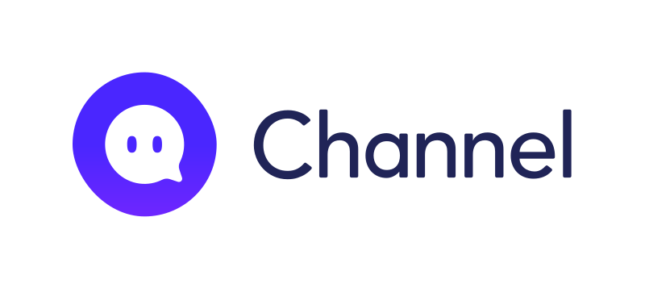

<picture>
  <source media="(prefers-color-scheme: dark)" srcset="./images/Channel.io_Logo_White.svg">
  <source media="(prefers-color-scheme: light)" srcset="./images/Channel.io_Logo_Color.svg">
  
</picture>

# channel-web-sdk-loader

[](https://www.npmjs.com/package/@channel.io/channel-web-sdk-loader)
[](https://github.com/channel-io/channel-web-sdk-loader/blob/main/LICENSE)
[](https://www.npmjs.com/package/@channel.io/channel-web-sdk-loader)
[](https://bundlephobia.com/result?p=@channel.io/channel-web-sdk-loader)


> The Official [Channel SDK](https://developers.channel.io/docs/sdk) Loader for Web

## Quick Links
- [📄 Official Developer Documentation](https://developers.channel.io/docs/web-channelio)
- [📄 TypeDoc API Reference](https://channel-io.github.io/channel-web-sdk-loader/)
- [📦 Playground - React Demo](https://codesandbox.io/p/sandbox/ch-web-sdk-playground-xm8ls8)

## Installation
### NPM
```bash
npm install @channel.io/channel-web-sdk-loader
```

### Yarn
```bash
yarn add @channel.io/channel-web-sdk-loader
```

### PNPM
```bash
pnpm install @channel.io/channel-web-sdk-loader
```

## Usage
> ⚠️ Note: This SDK is designed for client-side use only and should not be invoked on the server-side.

### Step1: Import the ChannelService Module
```typescript
import * as ChannelService from '@channel.io/channel-web-sdk-loader';
```

### Step2: Load the Channel Web SDK
```typescript
ChannelService.loadScript()
```

### Step3: Initialize the Channel Web SDK
```typescript
ChannelService.boot({
  pluginKey: 'YOUR_PLUGIN_KEY'
})
```
- Obtain your [plugin key](https://developers.channel.io/docs/web-boot-option#pluginkey) from the [Desk application](https://developers.channel.io/docs/glossary#desk).
- For additional information, please consult the [the official documentation](https://developers.channel.io/docs/sdk#get-a-plugin-key).

## API Documentation
- [📄 TypeDoc API Reference](https://channel-io.github.io/channel-web-sdk-loader/)

## Playground
- [📦 CodeSandbox - React Demo](https://codesandbox.io/p/sandbox/ch-web-sdk-playground-xm8ls8)